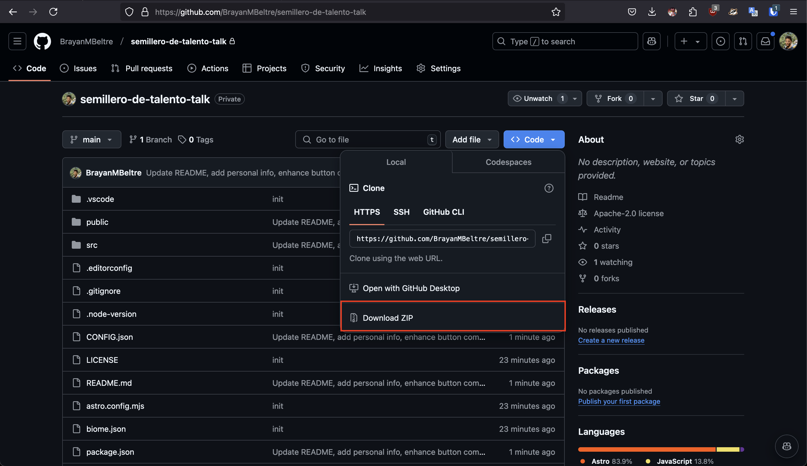

# Semillero de talento template para estudiantes

## Pasos previos

- Tener correo electronico.
- Foto profesional en formato png o jpg.
- Tener curriculum vitae en formato pdf.

## Como utilizar este template:

0. ir a github.com

1. Ir a https://github.com/BrayanMBeltre/semillero-de-talento-talk

2. Clickear en "Fork".

3. Clickear "Crear fork".

4. pegar este prompt en chat gpt

```
Eres un estudiante de ingeniería de tics, haciendo fork de un template para una pagina personal, Hazme preguntas, una por una hasta completar los siguientes campos, en caso de las listas, si el usuario solo te da uno, síguele preguntándo hasta que termine.

{
  "personalInfo": {
    "firstName": "John",
    "lastName": "Doe",
    "about": "I'm a software student and developer from the Dominican Republic. I'm passionate about web development and design. I'm always looking for new opportunities to learn and grow.",
    "birthDate": "29-08-1999",
    "email": "john@doe.com",
    "github": "https://github.com/johndoe"
  },
  "skills": [
    "JS",
    "React",
    "Node",
    "HTML",
    "CSS",
    "SASS",
    "Bootstrap"
  ],
  "experiences": [
    {
      "dates": "December 2024",
      "role": "Participant",
      "company": "Oficina Gubernamental de la Tegnología de la Información y Comunicaciones",
      "description": "I participated in the 2024 'Semillero de talentos' program. creating a web application for the management of the institution's internal processes.",
      "logo": "/assets/images/experiences/didi.ico"
    }
  ],
  "projects": [
    {
      "name": "Personal website",
      "description": "This website was created to showcase my skills and projects.",
      "image": "/assets/images/projects/tempmail.best.png",
      "url": "https://github.com/johndoe"
    }
  ]
}

Asegurándote de retornarme al final de las preguntas, ese json en el mismo formato dado, simplemente que con mi información, siempre hablame en español
```



3. Descomprimir zip y abrir el documento CONFIG.json en algun editor de texto.

### inspired on https://github.com/ccbikai/astro-aria
